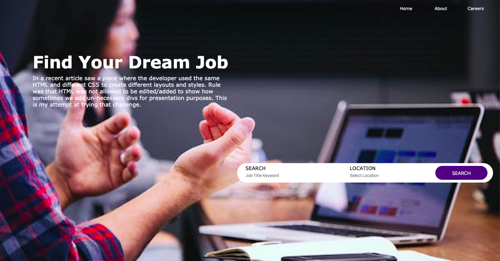
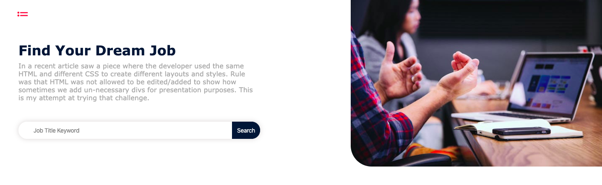
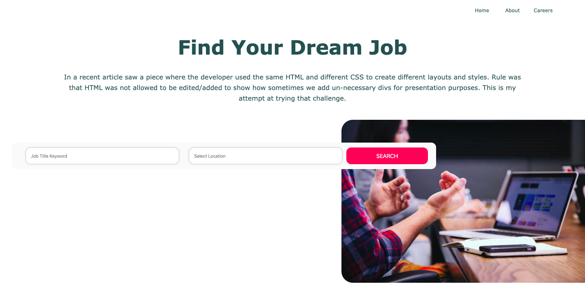

# Same HTML, Different CSS
Fun challenge creating different layouts using the same HTML code and different CSS. These layouts may not be the most performant or preferred way, and if this were a client/product page I would definitely make changes and/or additions for click events, responsiveness, functionality, accessibility, etc. This is simply intended as a fun and creative way to play with CSS, formatting, and page layout without adding in ~~10,000~~ extra ```<div>```s.

## HTML

```
<div class="section">
    <ul role="nav" class="nav">
        <li class="nav__list"><a class="nav__item" href="#">Home</a></li>
        <li class="nav__list"><a class="nav__item" href="#">About</a></li>
        <li class="nav__list"><a class="nav__item" href="#">Careers</a></li>
    </ul>
    <h1 class="title">Find Your Dream Job</h1>
    <p class="text__summary">In a recent article saw a piece where the developer used the same HTML and different CSS to create different layouts and styles. Rule was that HTML was not allowed to be edited/added to show how sometimes we add un-necessary divs for presentation purposes. This is my attempt at trying that challenge.</p>
    
    <form class="search__form">
        <label for="input1" class="search__label-1">Search</label>
        <input id="input1" class="search__input-1" placeholder="Job Title Keyword"></input>
        <label for="input2" class="search__label-2">Location</label>
        <input id="input2" class="search__input-2" placeholder="Select Location"></input>
        <button class="search__button">Search</button>
    </form>
</div>
```
## CSS Results

**stylesOne.css**



**stylesTwo.css**



**stylesThree.css**



**stylesFour.css**


**stylesFive.css**


**Photo Credit**

Headway on Unsplash
